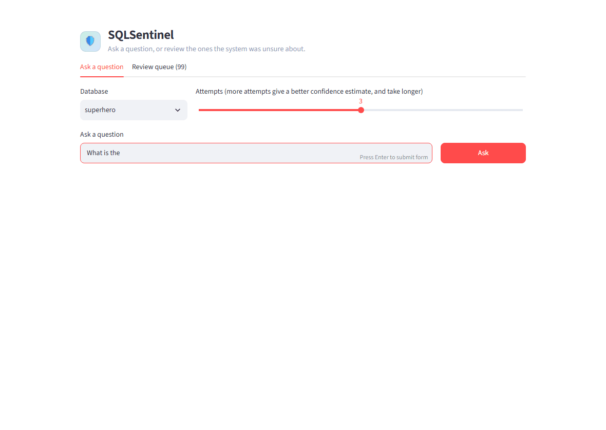
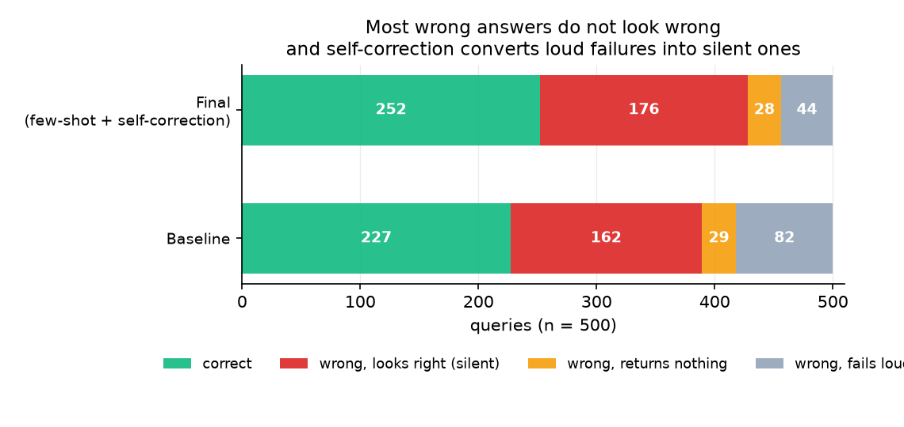
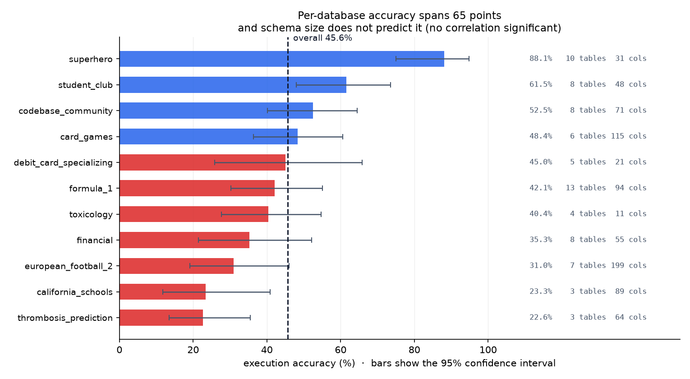
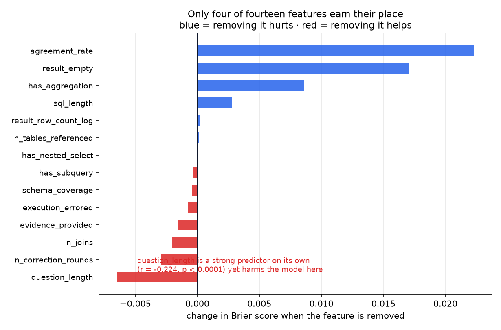

# SQLSentinel

[](https://github.com/Aayushnepal09/QueryMind_LLM/actions/workflows/ci.yml)
[](pyproject.toml)
[](LICENSE)
[](tests/)
[](pyproject.toml)

**A text-to-SQL agent that knows when it's wrong.**

Natural language → SQL, benchmarked on BIRD-SQL, with a calibrated confidence
score that routes uncertain queries to a human instead of executing them blind.

Rebuilt from [QueryMind](#what-changed-from-querymind), which worked but claimed
an accuracy nobody could verify. The headline artifact here is not the agent —
it is **[the evaluation](results/RESULTS.md)**: a measured baseline, a measured
delta, a calibration curve, a routing curve, and an honest account of what still
fails.

```
NL question ──► Schema Linker ──► SQL Generator ──► Self-Correction ──► Confidence Scorer
                (introspection)   (k samples,       (execute, re-prompt   (agreement +
                                   few-shot)         on error, ≤2)         14 features)
                                                                                │
                                            ┌───────────────────────────────────┴───┐
                                            ▼                                       ▼
                                    high confidence                    low confidence / risk rule
                                    auto-execute                       human review queue
```



When the agent is unsure, the query goes to a person — and the queue is built so
a **non-engineer** can action it: the question, its confidence *in words*
("all 3 attempts produced different answers"), the answer it would return, and a
plain-English description of the query, with the SQL one click away. Engineers
get the same queue with the SQL first and an editor. Both act on the same items
and log decisions identically.

Every step emits OpenTelemetry spans. Every eval run logs to MLflow. A CI gate
fails the build when execution accuracy regresses — when the benchmark data and
an API key are available to it; otherwise it reports what it is missing and
stops, rather than passing silently or failing a repository that is working.

---

## Results

| | n | EX | 95% CI |
|---|---:|---:|---:|
| Chance floor (`SELECT 1`) | 500 | 3.0% | ±1.5 |
| **Baseline** — ported QueryMind prompt, single-shot | 500 | **45.6%** | ±4.3 |
| **Final** — few-shot + self-correction | 500 | **50.4%** | ±4.4 |
| k=3 self-consistency | 200 | **55.0%** | ±6.8 |

Paired on the same questions: **+5.0 points** for the final configuration
(61 questions fixed, 36 broken, p = 0.014) and **+9.0 points** for k=3
self-consistency (30 fixed, 12 broken, p = 0.008). Both significant under an
exact McNemar test.

<sub>The paired delta is +5.0 while the table above shows 45.6% → 50.4% (+4.8).
Both are correct: the table reports BIRD's official scorer, while the paired
test uses per-question labels computed by this project's own executor, and the
two disagree on a single baseline question out of 500 (45.6% vs 45.4%).
`scripts/analyze.py` hard-fails if that gap ever exceeds half a question.</sub>

**→ [results/RESULTS.md](results/RESULTS.md)** — generated from MLflow and the
analysis artifacts, never hand-edited, so the reported numbers cannot drift from
the measured ones.
**→ [results/FINDINGS.md](results/FINDINGS.md)** — eight secondary findings the
headline number conceals.
**→ [results/technique-notes.md](results/technique-notes.md)** — why each
technique moved the number, or didn't.

Three things about how numbers are reported here:

1. **Every accuracy carries its confidence interval and n.** On the 500-question
   evaluation split the 95% CI is ±4.4 points; on the 50-question development
   loop it is ±13. A delta smaller than the interval is labelled as
   indistinguishable from noise rather than claimed as an improvement.
2. **The chance floor is ~3%, not 0%.** A predictor emitting `SELECT 1` scores
   3.0% because BIRD compares result *sets* and some gold queries return a
   scalar `1`. Read every number against that floor
   ([why](results/baseline-floor.md)).
3. **Negative results are kept.** Techniques that did not help have rows in the
   table with their real numbers, and a leakage bug that inflated an early
   result by 24.5 points is documented in
   [results/quarantine/](results/quarantine/README.md) rather than deleted.

### The finding that matters most

**59% of the baseline's wrong answers execute cleanly and return non-empty
results** — they are indistinguishable from correct answers without the gold
query. Self-correction *raises* that share to 71% while halving loud execution
errors: a safety regression concealed inside a 5-point accuracy improvement.



That gap between "the number went up" and "the system got safer" is the entire
argument for building the confidence layer rather than chasing another accuracy
point. Details, and seven more findings, in
[results/FINDINGS.md](results/FINDINGS.md).

---

## What the evaluation found

Beyond the headline delta, eight secondary analyses
([results/FINDINGS.md](results/FINDINGS.md)):

| Finding | Measured |
|---|---|
| Most errors are **silent** — they run and return plausible rows | 59% of baseline errors; 71% after self-correction |
| Per-database accuracy spread | **65 points** (22.6% → 88.1%), non-overlapping CIs |
| Schema size predicts difficulty | **No** — no correlation significant; table count trends positive |
| Confidence features that earn their place | **4 of 14**; `question_length` actively harms the model |
| The +5 point gain churned | fixed 61, broke 36, **net negative on challenging questions** |
| Question length predicts failure | r = −0.224, **p < 0.0001**; 61% → 14% across buckets |
| BIRD's evidence field is worth | +20 points overall, **2.5× more on moderate than simple** |
| Agreement tracks BIRD's difficulty labels | **No** — the signals are complementary, not redundant |
| Zero-row string-filter failures are case problems | **No** — only 8% recoverable by relaxing the match |

<p align="center">
  
</p>

<p align="center">
  
</p>

---

## Why this exists

QueryMind's README claimed *"92% accuracy on complex multi-table schemas."* That
number came from a private test set that does not exist in the repository — no
fixtures, no gold queries, no harness. It was unfalsifiable, and therefore worth
nothing to a reader.

SQLSentinel replaces it with three properties a demo does not have:

| Property | How |
|---|---|
| **Benchmarked** | Public BIRD-SQL dev set, scored by BIRD's own official execution-accuracy script (wrapped, not reimplemented) |
| **Calibrated** | Every query gets a confidence score; the reliability diagram shows whether that score means anything |
| **Observable** | OpenTelemetry traces, per-query cost and latency, and a CI gate that fails on regressions |

---

## Quick start

```bash
uv sync --extra dev
```

Get the BIRD dev set from <https://bird-bench.github.io/> and unpack it to
`data/bird/dev_20240627/` (full steps: [docs/reproducing.md](docs/reproducing.md)).

Verify the harness before trusting any number:

```bash
uv run python -m sqlsentinel.eval --split dev_50 --predictor stub
```

That should report ~3–4% and not crash. Then run the agent:

```bash
uv run python -m sqlsentinel.eval --split dev_50 --predictor agent
```

Or bring up the whole system:

```bash
docker compose up
```

API on `:8000`, review UI on `:8501`, trace viewer on `:6006`.

Or expose it to an MCP-speaking assistant:

```bash
uv run --extra mcp python -m sqlsentinel.mcp_server
```

Four tools — `list_databases`, `describe_database`, `ask`, `run_sql`. Every
`ask` response carries a `trust` field (`high` / `low` / `unusable`) rather than
returning an answer as bare fact, because 59% of this agent's wrong answers
execute cleanly and look plausible. `run_sql` rejects any non-read statement
before it reaches the database.

---

## Running it for free

This project has a hard constraint: **zero budget**. Both providers are free,
and the choice between them is a real engineering trade-off rather than a
formality.

| | Local `qwen2.5-coder:7b` | `gemini-2.5-flash` free tier |
|---|---|---|
| Cost | $0 | $0 |
| Latency | ~20 s/query (GTX 1660 Ti, 6 GB) | ~3 s/query |
| Throughput | unlimited | **~0.8 req/min sustained** after quota and backoff |
| 500 questions | ~3 hours | ~10 hours |

The measured sustained rate is the finding that decided the architecture: the
hosted model is six times faster per call but its free-tier quota makes it
*slower* for bulk evaluation. The local model became the workhorse; Gemini is
the comparison point.

**Response caching is load-bearing, not an optimisation.** Every call is cached
on `(provider, model, system, user, temperature, sample_index)`. Re-running an
unchanged configuration is instant. `sample_index` is in that key deliberately —
without it, all *k* samples of a self-consistency draw collapse to one cached
response, agreement rate becomes a constant 1.0, and the entire confidence
signal dies silently. There is a test pinning it.

---

## How the evaluation is set up

BIRD dev is 1,534 questions across 11 real databases (75 tables, 798 columns).
They are split once, seeded, and committed to
[`results/splits.json`](results/splits.json):

| Split | n | Purpose |
|---|---:|---|
| `eval_500` | 500 | **Reported.** Nothing is ever fitted on these. |
| `dev_50` | 50 | Fast development loop. A strict subset of `eval_500`. |
| `calib` | 1,034 | Fits the confidence model. **Disjoint from `eval_500`.** |

Stratified on difficulty × database — `eval_500` matches the population
distribution to within 0.1 points and covers all 11 databases.

The `calib`/`eval_500` disjointness is the project's most important invariant.
the spec calls training and reporting on the same questions *"the one mistake
that would invalidate the whole project"*, so it is enforced in code:
`ConfidenceModel.fit()` takes the evaluation ids as `forbidden_ids` and raises
on any overlap. It is a guard, not a convention.

Why 500 and not all 1,534: at n=500 the 95% CI is ±4.4 points, enough to support
the size of delta these techniques produce, while a full run at k=5 costs
several times the compute for a interval only ~2 points tighter.

---

## The confidence scorer

The differentiating piece. Two versions, both reported so the delta between them
is visible:

**v1 — agreement rate.** Generate *k* candidates at temperature 0.7, execute
each, normalise the result sets (order-insensitive, values stringified), and
take the fraction agreeing with the modal result. Agreement is computed over
*executed results*, not SQL text — two differently-written queries returning the
same rows are the same answer, which is exactly the equivalence BIRD scores on.

**v2 — calibrated classifier.** Logistic regression with isotonic calibration
over 14 features: agreement rate, tables referenced, aggregation/subquery/nesting
flags, pre-correction execution error, correction rounds, result size, empty
result, question length, evidence presence, schema coverage, SQL length, joins.

Measured effect: **Brier 0.262 → 0.194, ECE 0.203 → 0.051.** A well-calibrated
0.6 is more useful than an overconfident 0.9, and this is the layer that makes
the difference.

The training set is the `calib` split, disjoint from `eval_500` by construction,
and `ConfidenceModel.fit()` raises if they ever overlap. The service loads the
fitted model at startup and reports which scorer produced each number, so a
caller can tell a calibrated probability from a raw agreement ratio.

The review queue is shown at the top of this README; re-record it after a UI
change with `uv run python scripts/record_demo.py`.

**Risk overrides are not probabilistic.** Independent of confidence, these force
review: any non-`SELECT` statement, a failed execution, an oversized result set,
an unfiltered scan returning many rows. A `DELETE` does not become safe because
the model felt sure about it.

### Does the confidence score mean anything?

<p align="center">
  
  
</p>

**Left — reliability.** After calibration the curve sits on the diagonal:
predicted 0.26 → observed 0.25, 0.37 → 0.36, 0.76 → 0.71, 0.86 → 0.80. A score
of 0.7 means roughly a 70% chance of being right. Marker area is bin population.

| Scorer | Brier ↓ | ECE ↓ |
|---|---:|---:|
| v1 — raw agreement rate | 0.262 | 0.203 |
| **v2 — calibrated, 14 features** | **0.194** | **0.051** |

**Expected calibration error falls 4×.** v1 ranked risk correctly but overstated
confidence everywhere; v2 is what makes the number readable as a probability.
Fitted on `calib`, reported on the disjoint `eval_500`.

**Right — routing.** Every point above the dashed line beats routing at random.
**Sending 27% of queries to review catches 47% of all incorrect answers**, and
what still auto-executes is 67.1% correct rather than 54.5%.

The threshold is a reported tunable, not a constant — review 10% of traffic and
catch 22% of errors, or review 54% and catch 73%. Calibration is also what makes
that choice possible: the raw agreement rate at k=3 takes only four values and
gave three usable operating points, while the calibrated score gives 17 from the
same samples.

---

## Safety

The original executed generated SQL directly against a production PostgreSQL
database with no guard. SQLSentinel enforces read-only in three independent
layers, because any single one can be defeated:

1. **Statement inspection** — reject anything that is not a single `SELECT`/`WITH`.
   Comments are stripped first, so they cannot mask a write; stacked statements
   are rejected outright.
2. **Connection mode** — SQLite opens `?mode=ro`; Postgres sets the transaction
   read-only. Enforced by the database, not by our parser.
3. **Hard timeout** — wall-clock cap, so a pathological query cannot hang a run.

---

## What changed from QueryMind

Full audit: [docs/migration-notes.md](docs/migration-notes.md). The original is
preserved at tag **`v0-querymind`** and branch **`querymind-original`** — the
before state is evidence, not clutter.

```bash
git diff v0-querymind main     # the entire rebuild, as one diff
```

**Kept** (all three from `streamlit_app.py`, the only real assets in 503 lines):
the schema-context *shape*, the generation prompt, and the SQL extractor. Its
Postgres DSN builder became `executor.postgres_dsn_from_env()`.

The original application itself is **not carried here** — it lives at
`v0-querymind`, untouched, which is what makes `git diff v0-querymind main` the
complete before/after.

**Replaced:** the hardcoded `DATABASE_SCHEMA` string became live introspection
across 11 databases. The extractor was hardened — the original stripped
` ```sql ` fences and nothing else, so a response with a prose preamble and a
trailing explanation was handed to the executor verbatim.

**Dropped:** QueryMind's `default LIMIT 100`. Under BIRD's exact-result-set
scoring, an unrequested `LIMIT` turns correct answers into failures.

**Also found, and fixed or documented:**
- An SSH keypair committed in the repository's history (purged; the key should
  be treated as compromised and rotated).
- The Gemini key read from a secret named `OPENAI_API_KEY`.
- `test_render_database.py` opened a production connection *on import* — anything
  that auto-discovered it would have hit prod.

The spec expected more prior art than existed: there was no FastAPI layer, no
chain-of-thought, no few-shot exemplars, no schema introspection. The baseline
is therefore a genuinely naive zero-shot prompt, which makes the subsequent
deltas measure real technique rather than re-tuning.

---

## Known limitations

- **`dev_50` is underpowered, and this was measured rather than assumed.** Run
  with the identical configuration, the 50-question development loop scored
  62.0% while the full 500-question split scored 45.0% — **a 17-point
  overestimate whose 95% CI [48.2, 74.1] did not contain the true value**,
  despite stratification. Reporting the development-loop number would have
  claimed 62% for a system that scores 45.6%: the same class of error as
  QueryMind's unverifiable "92%", arrived at honestly. All reported numbers come
  from `eval_500`.
- **The failure taxonomy is heuristic.** It compares SQL text, not semantics, so
  it cannot tell a genuinely wrong join path from an equivalent one written
  differently. Limits stated in [docs/failure-taxonomy.md](docs/failure-taxonomy.md).
- **BIRD's own annotations contain known errors.** Some scored failures are cases
  where the prediction is defensible. This is why the benchmark is described as
  realistic and deliberately hard rather than as a ranking.
- **The CI gate is a smoke alarm, not a measurement.** On 50 questions a 3-point
  threshold sits well inside the noise; it catches breakage, not regression.
- **Schema pruning is close to a no-op on BIRD dev** (99% of tables retained,
  1.3% prompt reduction, identical accuracy). The measured reason is in
  [FINDINGS §2](results/FINDINGS.md): schema *size* does not predict difficulty
  here — no size measure correlates significantly with per-database accuracy,
  and `superhero` (10 tables) scores 88% while `thrombosis_prediction`
  (3 tables) scores 23%. Pruning attacks the wrong variable.
- **Not a leaderboard entry.** Top BIRD systems are large ensembles built over
  months. This is a single-model agent with an honest evaluation around it.

---

## Project layout

```
src/sqlsentinel/
├── llm.py             provider abstraction + response cache
├── schema_linker.py   introspection, DDL rendering, pruning
├── generator.py       prompt + SQL extraction
├── executor.py        read-only SQLite/Postgres, timeout, normalization
├── retrieval.py       TF-IDF exemplar retrieval (calib split only)
├── agent.py           orchestration, self-correction, k-sample voting
├── confidence.py      features, calibrated model, Brier/ECE
├── router.py          risk rules, threshold, routing curve
├── tracing.py         OpenTelemetry (no-ops when unconfigured)
├── api.py             FastAPI service
├── mcp_server.py      MCP tools for assistant integration
└── eval/              official BIRD harness wrapper + splits
app/review_ui.py       Streamlit review queue
scripts/               experiment sweep, analysis, report generation
third_party/           BIRD's official scorer, wrapped not reimplemented
results/               committed metrics, figures, splits, traces
tests/                 264 tests, 92% coverage
```

## Documentation

| | |
|---|---|
| [results/RESULTS.md](results/RESULTS.md) | Every measured number, generated from the run artifacts |
| [results/FINDINGS.md](results/FINDINGS.md) | Nine secondary findings the headline number conceals |
| [results/technique-notes.md](results/technique-notes.md) | Why each technique moved the number, or didn't |
| [docs/reproducing.md](docs/reproducing.md) | Fresh clone → scored number |
| [docs/failure-taxonomy.md](docs/failure-taxonomy.md) | Failure categories, with worked examples |
| [docs/migration-notes.md](docs/migration-notes.md) | What was kept from QueryMind, and what was found wrong with it |
| [docs/spec.md](docs/spec.md) | The design specification this was built against |

## Licence

**All rights reserved.** This repository is public so the work can be read and
evaluated. Using, copying, or modifying any part of it requires prior written
permission — see [LICENSE](LICENSE). Permission is usually granted for academic
and non-commercial use; the requirement exists so that use is known, not to
prevent it.

`third_party/evaluation.py` is BIRD-SQL's official scorer and remains under its
own terms.
